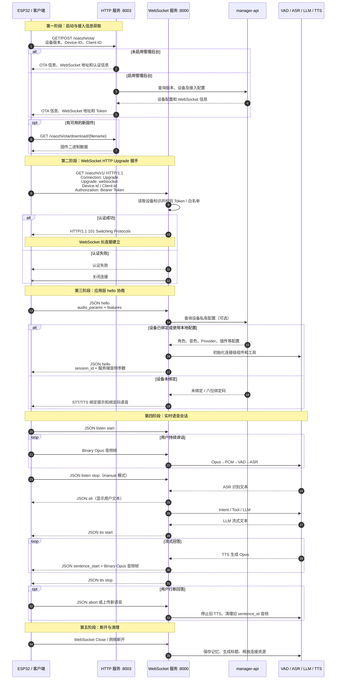

# xiaozhi-server 运行流程

## 一、整体流程

```text
ESP32 / 客户端设备
        │
        │ WebSocket：JSON 控制消息 + Opus 音频
        ▼
连接认证、设备绑定与私有配置加载
        ▼
Opus 解码为 PCM
        ▼
VAD 判断是否有人说话
        ▼
ASR 语音识别（可并行进行声纹识别）
        ▼
意图处理
   ├── 退出命令 / 唤醒词 → 专用逻辑
   ├── 插件 / IoT / MCP  → 执行工具
   │                         └── 必要时将结果交回 LLM
   └── 普通对话           → LLM
        ▼
LLM 流式输出文本
        ▼
TTS 流式生成 Opus 音频
        ▼
通过 WebSocket 回传设备播放
```

## 二、服务启动

启动入口：`main/xiaozhi-server/app.py`

执行 `python app.py` 后：

1. 检查 FFmpeg 是否安装。
2. 加载本地配置，或从 `manager-api` 获取配置。
3. 初始化认证使用的 `auth_key`。
4. 启动全局 GC 管理器。
5. 启动 WebSocket 服务，默认端口为 `8000`。
6. 启动 HTTP 服务，默认端口为 `8003`。

主要地址：

```text
WebSocket： ws://服务器:8000/xiaozhi/v1/
OTA：       http://服务器:8003/xiaozhi/ota/
视觉分析：  http://服务器:8003/mcp/vision/explain
```

HTTP 服务由 `core/http_server.py` 提供。未接入管理后台时，它还负责向设备下发 WebSocket 地址和 OTA 信息。

## 三、建立 WebSocket 连接

入口：`main/xiaozhi-server/core/websocket_server.py`

客户端建立连接时，服务端从 Header 或 URL 参数读取：

- `device-id`
- `client-id`
- `authorization`

如果开启认证：

1. 白名单设备直接放行。
2. 其他设备校验 Bearer Token。
3. 认证失败时发送“认证失败”并关闭连接。

认证成功后，每个设备都会创建独立的 `ConnectionHandler`。每条连接分别维护：

- `session_id`
- 对话历史
- 音频缓冲区
- TTS 队列
- 当前说话人
- IoT 和 MCP 状态
- 超时检查任务

核心实现位于 `main/xiaozhi-server/core/connection.py`。

## 四、设备配置和组件初始化

连接建立后，`ConnectionHandler` 在后台加载配置和组件。

开启 `read_config_from_api` 时，会根据 `device-id` 和 `client-id` 从管理后台获取设备私有配置，包括：

- 设备绑定状态和绑定码
- 角色提示词
- VAD、ASR、LLM、TTS Provider
- 音色
- Memory 和 Intent
- 插件配置
- 声纹配置
- MCP 接入点
- 每日输出限制

设备尚未绑定时，普通输入会被丢弃，服务端定期播放绑定提示及六位绑定码。

未启用管理后台时，直接使用本地 `config.yaml`。

组件由 `core/utils/modules_initialize.py` 统一创建。VAD、ASR、LLM、TTS、Intent 和 Memory 都采用 Provider 结构，可以通过配置切换实现。

## 五、消息路由

WebSocket 消息分为文本帧和二进制帧。

### 5.1 文本帧

文本帧通常是 JSON 控制消息，由 `core/handle/textMessageProcessor.py` 和处理器注册表分发。

| type | 用途 |
|---|---|
| `hello` | 协商音频参数、MCP、AEC 等客户端能力 |
| `listen` | 开始录音、停止录音或直接提交文字 |
| `abort` | 打断当前回答 |
| `iot` | 上报设备 IoT 能力和状态 |
| `mcp` | 处理设备端 MCP 消息 |
| `server` | 服务端控制消息 |
| `ping` | 心跳检测 |

收到 `hello` 后，服务端返回欢迎消息和会话信息，同时读取：

- 音频格式与采样率
- 客户端是否支持 MCP
- 是否启用服务端 AEC
- 是否支持表情等特性

### 5.2 二进制帧

二进制帧主要承载 Opus 音频。处理流程是：

```text
收到二进制帧
  → 解析 MQTT 音频头（如果来自 MQTT 网关）
  → Opus 解码为 PCM
  → 可选 AEC 回声消除
  → 放入当前连接的 ASR 音频队列
```

MQTT 网关音频前带有 16 字节头，其中包含序号、时间戳和数据长度。

## 六、VAD 和 ASR

主要实现：

- `core/handle/receiveAudioHandle.py`
- `core/providers/asr/base.py`

音频队列中的 PCM 帧按被依次处理：

```text
PCM 帧
  → VAD 判断当前帧是否包含人声
  → 保存到本轮 ASR 音频缓冲区
  → 检测到说话结束
  → 调用选定的 ASR Provider
  → 得到文字
```

拾音模式：

- `manual`：客户端发送 `listen stop` 后触发识别。
- `auto`：VAD 检测到语音结束后自动触发识别。
- 流式 ASR：音频边接收边发送给 ASR 服务，结束时发送停止请求。

如果配置了声纹识别，ASR 与声纹识别会并行执行，结果可能整理成：

```json
{
  "speaker": "张三",
  "content": "今天天气怎么样"
}
```

有效识别文本最终进入 `startToChat()`。

## 七、意图识别和工具调用

入口：`core/handle/intentHandler.py`

识别文字按以下顺序处理：

1. 检查是否为明确的退出命令。
2. 检查是否为唤醒词。
3. 判断是否需要调用工具。
4. 未被专用逻辑处理时进入普通 LLM 对话。

意图模式包括：

- `nointent`：不单独识别意图，直接交给 LLM。
- `intent_llm`：使用专门的意图模型判断并执行工具。
- `function_call`：把工具描述交给主 LLM，由主 LLM 决定是否调用。

工具来源包括：

- `plugins_func/functions/` 中的本地插件
- 服务端 MCP
- 设备端 MCP
- 设备 IoT
- MCP Endpoint

工具结果可以：

- 直接回复用户；
- 记录到对话历史；
- 重新交给 LLM 组织最终回答；
- 返回工具不存在或执行失败信息。

工具与 LLM 可以递归交互，但最大调用深度限制为 5，防止无限循环。

## 八、LLM 对话

主要入口：`ConnectionHandler.chat()`。

调用 LLM 前会组合：

- System Prompt
- 当前对话历史
- 长期或短期记忆
- 声纹识别出的说话人信息
- 当前可用工具定义
- 其他上下文信息

LLM 采用流式输出。每产生一段文本就立即写入 TTS 文本队列，因此不用等完整回答生成完毕才开始合成语音：

```text
LLM 生成第一段文字 → TTS 开始合成 → 设备开始播放
LLM 继续生成后文   → TTS 继续合成 → 设备继续播放
```

这是服务降低首字延迟和首包延迟的关键设计。

## 九、TTS 与音频回传

发送逻辑位于 `core/handle/sendAudioHandle.py`。

典型回复顺序：

```text
1. {"type":"stt","text":"用户说的话"}
2. {"type":"tts","state":"start"}
3. {"type":"tts","state":"sentence_start","text":"回答文本"}
4. 二进制 Opus 音频包……
5. {"type":"tts","state":"stop"}
```

TTS 主要维护两个队列：

- 文本队列：接收 LLM 的流式文字。
- 音频队列：存放 TTS 生成的 Opus 包。

音频发送带有流控机制：

1. 前 5 个包立即发送，减少首包延迟。
2. 后续音频按播放速度发送，避免设备缓冲区瞬间堆积。
3. 每轮回答使用独立 `sentence_id`。
4. 新问题到来后，旧 `sentence_id` 的残留音频会被丢弃。

## 十、打断机制

以下情况可以中断当前回答：

- 客户端发送 `abort`。
- 开启 AEC 时，服务端检测到用户在播放期间重新说话。
- 新一轮对话覆盖上一轮回答。

打断后通常会：

1. 设置 `client_abort`。
2. 停止旧音频发送。
3. 清理旧 TTS 队列和流控状态。
4. 开始处理新的用户输入。

`manual` 模式下不会自动用新语音打断正在播放的内容。

## 十一、连接结束和资源清理

连接可能因为以下原因结束：

- 用户说出退出命令。
- 客户端主动断开。
- 长时间没有语音活动。
- 当前回答完成后要求关闭。
- 二级连接超时。

连接关闭时会：

1. 后台生成会话标题。
2. 保存记忆。
3. 上报 ASR、TTS 和工具调用记录。
4. 清理 VAD、ASR、TTS、MCP 和 AEC 资源。
5. 清空音频与报告队列。
6. 停止超时任务和线程池。
7. 关闭 WebSocket。

## 十二、关键代码导航

| 文件 | 职责 |
|---|---|
| `main/xiaozhi-server/app.py` | 程序入口，同时启动 WebSocket 和 HTTP 服务 |
| `core/websocket_server.py` | WebSocket 监听、认证和连接创建 |
| `core/connection.py` | 单设备连接的核心状态与完整对话编排 |
| `core/http_server.py` | OTA 与视觉分析 HTTP 接口 |
| `core/handle/textMessageProcessor.py` | JSON 控制消息分发 |
| `core/handle/helloHandle.py` | Hello 协议和客户端能力协商 |
| `core/handle/receiveAudioHandle.py` | VAD、音频接收和聊天入口 |
| `core/providers/asr/base.py` | ASR 音频队列和识别公共流程 |
| `core/handle/intentHandler.py` | 意图识别与工具执行 |
| `core/handle/sendAudioHandle.py` | TTS 状态和 Opus 音频回传 |
| `core/utils/modules_initialize.py` | Provider 模块创建 |

## 十三、一句话总结

`xiaozhi-server` 是一个以 WebSocket 为实时传输通道、以 `ConnectionHandler` 为单设备会话核心，将 VAD、ASR、Intent/Tools、LLM、TTS 串联起来的异步语音对话服务。

## 十四、服务端与客户端网络握手图

下面的时序图把 HTTP 和 WebSocket 串在一起：HTTP 负责设备启动、OTA 和接入信息查询；WebSocket Upgrade 成功后，后续实时对话都在同一条长连接上进行。



### 握手的两个层次

这里容易混淆的地方是，项目实际上有两次“握手”：

1. **协议层握手**：客户端发送标准 HTTP Upgrade 请求，服务端认证成功后返回 `101 Switching Protocols`，HTTP 连接升级为 WebSocket。
2. **业务层握手**：WebSocket 建立后，客户端再发送 `type=hello`，协商采样率、音频格式、MCP、AEC 等能力；服务端返回带 `session_id` 的 hello 消息。

只有这两步都完成，连接才真正具备完整的实时语音对话能力。
